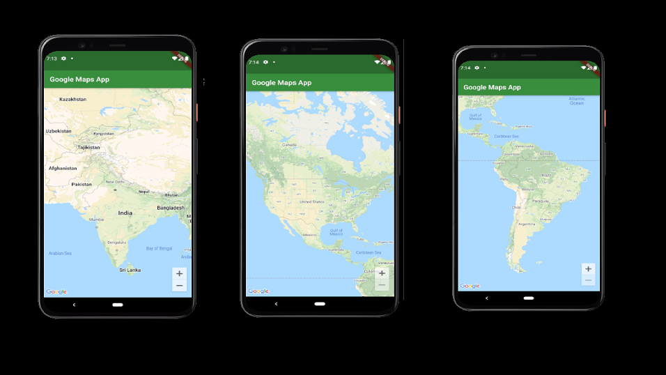

# googlemaps


<br><br>
A Flutter App which contains Google Maps API to Run on Andriod Devices.
<b>Note: </b> To run this app you will need a Google Maps API Key.
You can get API Key from <a href="https://cloud.google.com/maps-platform/"> Google Cloud Console.</a> 
For step by step on how to get the API Key Follow this Docs by Google on <a href="https://developers.google.com/maps/documentation/android-sdk/get-api-key">Get an API KEY</a> 

Once you have the API Key you can add it to the AndroidManifest File and then you will be able to run this App. Folowing is the path of the AndroidManifest File.
```
android/app/src/main/AndroidManifest.xml
```
You have to add your API key inside the double quotes of the parameter: meta-data andoid and attribute: android value.

```
<meta-data android:name="com.google.android.geo.API_KEY"
android:value="YOUR_API_KEY"/>
```

Once you add the API Key you will be able to run this app.
<br><br>


